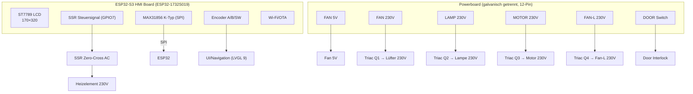

# Filament-Dryer ESP32 – Schritt 2: Hardware-Architektur & Signalplanung
**System:** ESP32-S3 HMI Board (ESP32-1732S019) + Powerboard (12-Pin Connector)  
**Datum:** 31. Oktober 2025

---

## Überblick

Der Filament-Dryer basiert auf dem **ESP32-S3-R8N16-HMI-Board (ESP32-1732S019)** mit integriertem **1,9″ ST7789 Display (170×320)** und **Drehencoder**.  
Die 230-V-Verbraucher (Lüfter, Lampe, Motor) werden über das vorhandene **Powerboard** mit **12-Pin-Schnittstelle** geschaltet.  
Die **Heizung** wird **nicht mehr** über das Relais des Powerboards angesteuert, sondern über ein **externes Solid State Relay (SSR, Zero-Cross, AC)**.  
Die **Temperaturmessung** erfolgt mit einem **K‑Typ‑Thermoelement** über einen **MAX31856** (SPI), **separat** vom 12‑Pin‑Stecker.

---

## Systemarchitektur (Blockdiagramm)

---

## 12‑Pin‑Connector (P1 – P12)

|   Pin   | Bezeichnung | Typ / Richtung          | Signalpfad                         | Beschreibung / Funktion                                                  |
| :-----: | :---------- | :---------------------- | :--------------------------------- | :----------------------------------------------------------------------- |
| **P1**  | TEMP (NTC)  | Eingang (analog)        | –                                  | **Nicht belegt.** Temperaturmessung erfolgt extern via MAX31856 (K‑Typ). |
| **P2**  | +5 V        | Ausgang (DC)            | ← 7805 / Sekundärnetzteil          | 5‑V‑Versorgung für Logik/Peripherie des Powerboards.                     |
| **P3**  | GND         | Bezugspotential         | ← Sekundär‑GND                     | Masse der Logik‑/Sensorkreise (galvanisch getrennt von Netz).            |
| **P4**  | NC          | –                       | –                                  | Reserve.                                                                 |
| **P5**  | FAN 5V      | Ausgang (digital)       | → Q5 → Lüfter 5 V                  | Schaltet internen 5‑V‑Lüfter (PWM/Ein‑Aus).                              |
| **P6**  | HEATER REL  | –                       | –                                  | **Deaktiviert.** Heizung über externes SSR.                              |
| **P7**  | FAN 230V    | Ausgang (digital, Opto) | → Q8 → PD1 → Q1 (Triac)            | Schaltet 230‑V‑Lüfter (galvanisch getrennt).                             |
| **P8**  | LAMP 230V   | Ausgang (digital, Opto) | → Q9 → PD2 → Q2 (Triac)            | Schaltet Innenbeleuchtung.                                               |
| **P9**  | MOTOR 230V  | Ausgang (digital, Opto) | → Q10 → PD3 → Q3 (Triac)           | Schaltet Motor/Antrieb.                                                  |
| **P10** | FAN‑L 230V  | Ausgang (digital, Opto) | → Q11 → PD4 → Q4 (Triac)           | Zweiter 230‑V‑Lüfterzweig / Neutralpfad.                                 |
| **P11** | NC          | –                       | –                                  | Reserve.                                                                 |
| **P12** | DOOR        | Eingang (digital)       | → Pull‑Up → Türschalter (nach GND) | Türkontakt, **aktiv LOW** (geschlossen = GND).                           |

---

## ESP32‑S3 Pin‑Mapping (Header‑Pins des ESP32‑1732S019)

**Display belegt intern:** SCK=12, MOSI=13, CS=10, DC=11, RST=1, BL=14 (keine Header‑Konflikte).

| Funktion                     | ESP32‑Pin           | Richtung     | Beschreibung                                                                        |
| :--------------------------- | :------------------ | :----------- | :---------------------------------------------------------------------------------- |
| **SSR Heater (extern)**      | **GPIO7**           | Out          | Steuert SSR (Eingang 3–32 VDC), **Aktiv HIGH**; Zeit‑Proportionierung (TPM, 1,0 s). |
| **FAN 5 V (P5)**             | **GPIO6**           | Out          | Low‑Side‑Treiber (Q5) für 5‑V‑Lüfter.                                               |
| **FAN 230 V (P7)**           | **GPIO15**          | Out          | Optokoppler PD1 → Triac Q1.                                                         |
| **LAMP 230 V (P8)**          | **GPIO16**          | Out          | Optokoppler PD2 → Triac Q2.                                                         |
| **MOTOR 230 V (P9)**         | **GPIO17**          | Out          | Optokoppler PD3 → Triac Q3.                                                         |
| **FAN‑L 230 V (P10)**        | **GPIO18**          | Out          | Optokoppler PD4 → Triac Q4.                                                         |
| **DOOR (P12, aktiv LOW)**    | **GPIO19**          | In (Pull‑Up) | Türkontakt, SW‑invertiert (`door_closed = (LOW)`).                                  |
| **Encoder A**                | **GPIO20**          | In (Pull‑Up) | Quadratur A (Interrupt/PCNT möglich).                                               |
| **Encoder B**                | **GPIO21**          | In (Pull‑Up) | Quadratur B.                                                                        |
| **Encoder Switch**           | **GPIO5**           | In (Pull‑Up) | Taster, kurz/lang (z. B. 50 ms / 1,2 s).                                            |
| **Buzzer (optional)**        | **GPIO38**          | Out (PWM)    | Alarm/Feedback (LEDC).                                                              |
| **I²C optional (RH‑Sensor)** | **GPIO39 / GPIO41** | SDA / SCL    | Für SHT4x o. ä. (später).                                                           |

**Nicht für Lasten verwenden:** GPIO2, GPIO45 (Boot/Strapping).  
**Freie Reserven:** GPIO40, 42, 47, 48 (werden für SPI K‑Typ genutzt, siehe unten).

---

## Externer Temperatursensor – K‑Typ + MAX31856 (SPI, 3,3 V)

|  Signal  | ESP32‑Pin  | Richtung | Hinweise               |
| :------: | :--------: | :------: | :--------------------- |
|  **CS**  | **GPIO47** |   Out    | Chip‑Select MAX31856   |
| **SCK**  | **GPIO40** |   Out    | SPI‑Clock              |
| **MOSI** | **GPIO48** |   Out    | Daten zum MAX31856     |
| **MISO** | **GPIO42** |    In    | Messdaten vom MAX31856 |
| **VCC**  |    3V3     |    –     | Modulversorgung        |
| **GND**  |    GND     |    –     | Bezugsmasse            |

**Empfehlungen:**  
- Leitungen K+ / K− verdrillt, ggf. geschirmt; Schirm **einseitig** an GND.  
- **50/60‑Hz‑Filter** im MAX31856 aktivieren; **Polling** per SPI (DRDY optional).  
- Software‑Mittelwert (8–16 Samples), Abtastrate ~5 Hz.  
- Kalibrierung/Offset in den Settings (UI) hinterlegen.

---

## SSR‑Heizungsansteuerung (Zero‑Cross, AC)

| Komponente        | Anschluss                           | Beschreibung                                               |
| :---------------- | :---------------------------------- | :--------------------------------------------------------- |
| **SSR Eingang +** | von **GPIO7** über **330 Ω – 1 kΩ** | LED‑Strom 5–10 mA je nach SSR‑Datenblatt                   |
| **SSR Eingang −** | GND                                 | Rückleiter                                                 |
| **Logikpegel**    | HIGH = EIN                          | Einheitliche Logik für TPM/PID                             |
| **Steuerart**     | TPM‑Fenster **1,0 s**               | Kompatibel zu PID‑Duty (`0..100 %`)                        |
| **Sicherheit**    | Boot‑Safe, Watchdog                 | Ausgänge beim Boot AUS; Freigabe erst nach POST & Tür‑OK   |
| **Mechanik**      | Kühlkörper/Belüftung                | SSR nach Laststrom auslegen, RC‑Snubber falls erforderlich |

---

## Sicherheit & Failsafe

- **Harte Abschaltung > 120 °C** (K‑Typ‑Messung): SSR aus, P7–P10 aus, Alarm.  
- **Tür offen (P12=HIGH):** SSR aus, Lasten aus; 5‑V‑Lüfter ggf. auf Safe‑Drehzahl.  
- **Boot‑Safe:** Alle Aktoren AUS, erst nach **POST** (Sensoren plausibel) wird freigegeben.  
- **Galvanische Trennung:** 12‑Pin‑Leitungen P7–P10 gehen über Optokoppler/Triacs.  
- **Kriech-/Luftstrecken:** Netzseite ≥ 6 mm; saubere Kabelführung (Führung 230 V getrennt von Signal).  
- **Thermosicherung/‑schalter:** Mechanische Sicherungen am Heizer/Luftstrom beibehalten.  

---

## Analoge Frontend-Reste (P1/TEMP)

- **P1/TEMP (NTC)** bleibt **unbenutzt** (keine Verdrahtung).  
- ADC‑Ressourcen des ESP32 werden nicht benötigt (Temperatur kommt vom MAX31856).

---

## Start‑/Selbsttest (POST) & Service‑Modus

**POST:**  
1) MAX31856 init, Messwert plausibel (−40…+300 °C).  
2) DOOR (P12) erkannt & invertiert.  
3) Ausgänge P5, P7–P10 definieren (kurzer LED‑/Status‑Selbsttest **ohne** Last).  
4) SSR bleibt **aus**, bis Schritt 1–3 OK sind.

**Service‑Modus:**  
- Einzelansteuerung P5/P7/P8/P9/P10.  
- SSR‑Duty‑Test 0/25/50/75/100 % (TPM).  
- Encoder‑/Taster‑Test.  
- Live‑SPI‑Dump des MAX31856 (Fehlerflags, CJ‑Temp, Thermo‑Temp).

---

## Mess‑ und Verdrahtungshinweise

- **Sekundärseite messen:** Bezüge immer zu **P3 (GND)**.  
- **Keine Primärmessungen** ohne Trenntrafo/Fachkenntnis.  
- **Leitungsführung:** Sensor‑/SPI‑Leitungen getrennt von 230‑V‑Leitungen führen, Kreuzungen im 90°‑Winkel.  
- **EMV:** Optional Ferrit/RC an SSR‑Eingang, saubere Masseführung (Sternpunkt).

---

## Zusammenfassung

- 12‑Pin‑Powerboard wird für **230‑V‑Lasten** (P7–P10), **5‑V‑Lüfter** (P5) und **Türkontakt** (P12) genutzt.  
- **Heizer** läuft über **externes SSR** (GPIO7), **NTC entfällt**.  
- **Primärsensor** ist **K‑Typ + MAX31856** per SPI (GPIO40/42/48/47).  
- Design erfüllt die Anforderungen: **Silicagel‑Betrieb bis 120 °C**, **Cutoff >120 °C**, **Encoder‑Bedienung**, **MVP‑/PID‑fähig**.
