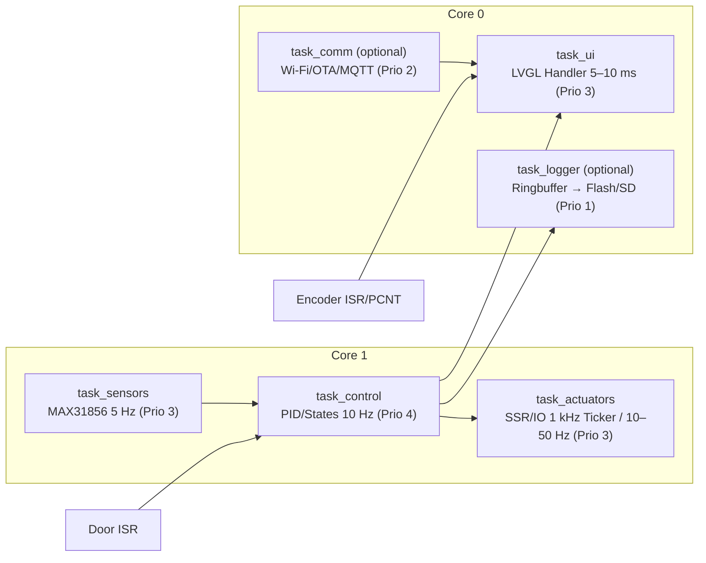
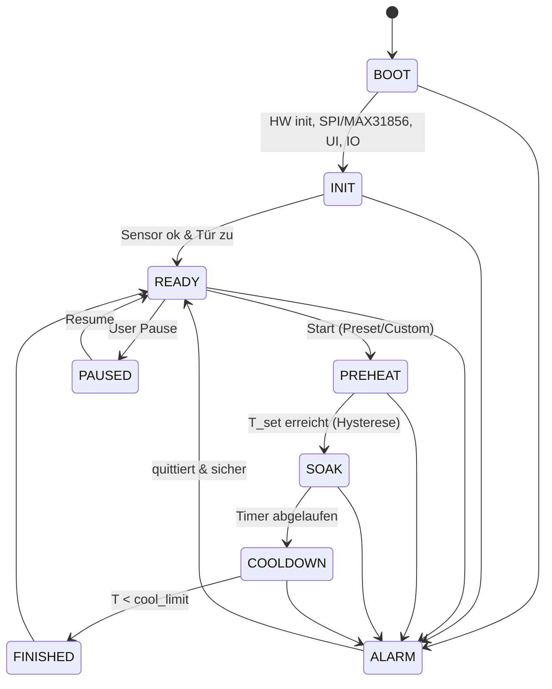

# Schritt 3 – Software-Architektur & Systemlogik (mit FreeRTOS)
**Projekt:** Filament-Dryer ESP32  
**Hardware:** ESP32‑S3 HMI (ESP32‑1732S019), ST7789 170×320, Encoder A/B/SW, K‑Typ + MAX31856 (SPI), SSR (Zero‑Cross), Powerboard (12‑Pin)  
**Datum:** 31. Oktober 2025

---

## 1. Ziele dieses Schritts
- Festlegen der **Software-Module**, **FreeRTOS-Tasks**, **Prioritäten** und **Kernzuordnung**.  
- Definition der **Zustandsmaschine** (Betriebsmodi), **Regelstrategie** (PID + TPM) und **Sicherheitsmatrix**.  
- Spezifikation der **Inter-Task-Kommunikation** (Queues, EventGroups, Mutex).  
- Klare **Timer-/Tick-Konfiguration** für LVGL, Regelung, SSR-Fenster und Sensorpolling.  
- Grundlage für die Implementierung der **Code-Skeletons** in Schritt 4.

---

## 2. Top-Level Architektur



---

## 3. Tasks, Kerne & Prioritäten

| Task                     | Zweck                                     | Taktung                           | Core  |  Prio | Stack (Richtwert) |
| ------------------------ | ----------------------------------------- | --------------------------------- | ----- | ----: | ----------------: |
| **task_control**         | PID‑Regelung, States, Safety              | **10 Hz** (`vTaskDelayUntil`)     | **1** | **4** |              8 KB |
| **task_sensors**         | MAX31856 lesen, Plausibilität, Mittelwert | **5 Hz**                          | 1     |     3 |              6 KB |
| **task_actuators**       | SSR‑TPM, 230V/5V‑Ausgänge setzen          | **TPM 1 s** (Duty), GPIO 10–50 Hz | 1     |     3 |              4 KB |
| **task_ui**              | LVGL Handler, Encoder‑Events              | alle **5–10 ms**                  | **0** |     3 |             16 KB |
| **task_comm** *(opt.)*   | Wi‑Fi/OTA/MQTT                            | ereignisgesteuert                 | 0     |     2 |              8 KB |
| **task_logger** *(opt.)* | Ringbuffer → SD/Flash                     | 1–2 Hz                            | 0     |     1 |              6 KB |

> **Rationale:** Core 1 bleibt frei von Wi‑Fi‑Interruptlast → stabile Regelung. Core 0 verträgt UI/Netzwerk besser.

---

## 4. Zeitbasis & Timer

- **LVGL‑Tick:** `esp_timer` alle **5 ms** → `lv_tick_inc(5)`  
- **LVGL‑Handler:** `task_ui` ruft `lv_timer_handler()` so oft wie möglich (5–10 ms)  
- **PID‑Loop:** `task_control` **10 Hz**, feste Periode (`vTaskDelayUntil`)  
- **SSR‑TPM:** Fenster **1000 ms**; Duty 0…100 % → Einzeit `= duty * 1000 ms`  
- **Sensorpolling (MAX31856):** **5 Hz** (SPI‑Polling); 8–16er Moving Average  
- **Encoder/Tür:** GPIO‑ISR + Debounce in Software (10–20 ms)  

---

## 5. Zustandsautomat (Betriebsmodi)



**Modus-Details**  
- **PREHEAT:** Boost‑Begrenzung (z. B. Duty ≤ 80 %), Anti‑Windup aktiv.  
- **SOAK:** PID hält `T_set`; Laufzeit‑Countdown aktiv.  
- **COOLDOWN:** SSR aus; Lüfter(n) laufen bis `T_meas < cool_limit`.  
- **ALARM:** SSR aus, 230V‑Ausgänge aus; Safe‑Fan an; akustische/visuelle Anzeige.  

---

## 6. Inter‑Task‑Kommunikation

### 6.1 Queues
- `q_measurements` (Sensors → Control)  
  ```c
  typedef struct {
    float T_chamber;   // °C (Thermo)
    float T_cj;        // °C (Cold‑Junction, optional)
    uint32_t t_ms;     // Zeitstempel
  } meas_t;
  ```
- `q_ui_events` (Encoder/Tür → UI): Taste, Drehimpulse, Langdruck, Türstatus  
- `q_alarms` (Safety → UI/Logger): Typ, Zeit, Kontext

### 6.2 EventGroups
- `EG_SAFETY`: `DOOR_OPEN`, `OVERTEMP`, `SENSOR_FAIL`  
- `EG_MODE`: `RUNNING`, `PAUSED`, `FINISHED`

### 6.3 Mutex / Semaphoren
- `mtx_spi` für exklusiven MAX31856‑Zugriff  
- `mtx_lvgl` (nur **eine** Task zeichnet: `task_ui`)

---

## 7. Regelstrategie (PID + TPM)

- **PID‑Regelkreis (10 Hz):**  
  `duty = clamp( PID(T_set, T_meas), 0.0, 1.0 )`  
- **Zeit‑Proportionierung (TPM, 1 s):**  
  - Bei Fensterbeginn: SSR **EIN** für `duty * 1000 ms`, dann **AUS** bis Fensterende.  
  - **Min‑On/Off‑Zeit** (z. B. 100 ms), um Flimmern/Rattern bei sehr kleinen Duties zu vermeiden.  
- **Silicagel‑Modus:** RH ignoriert, `T_set ≤ 120 °C`; **Hard‑Cut > 120 °C**.  
- **PREHEAT‑Boost:** optional `Kp_boost`, `duty_max_preheat` zur schnelleren Aufheizung ohne Überschwingen.

**PID‑Parameter (Startwerte, zu tunen):**  
- `Kp = 12.0`, `Ki = 0.6`, `Kd = 0.0` (abhängig von Kammerträgheit; nur Richtwerte)  
- **Anti‑Windup:** Clamping des I‑Anteils bei Duty‑Sättigung (0 oder 1)  
- **Derivativer Filter:** optional Low‑Pass auf `dT/dt`

---

## 8. Safety‑Matrix

| Ereignis           | Erkennung             | Sofortmaßnahme           | Folgeaktion                       |
| ------------------ | --------------------- | ------------------------ | --------------------------------- |
| **Tür offen**      | GPIO‑ISR (P12)        | SSR aus, Timer pausieren | UI Warnung, Event setzen          |
| **T > 120 °C**     | task_control          | SSR aus, P7–P10 aus      | ALARM‑State, Quittierung nötig    |
| **Sensorfehler**   | MAX31856 Fault/CRC    | SSR aus                  | ALARM‑State                       |
| **Timeout Heizen** | `PREHEAT` > Grenzwert | SSR aus                  | ALARM‑State „No Heat Ramp“        |
| **Watchdog**       | WDT Trigger           | Systemreset              | Startup‑Gate (kein Heizen bis ok) |

**Startup‑Gate:** Erst heizen, wenn **erste valide Temperatur** empfangen **und** **Tür geschlossen**.

---

## 9. Einstellungen & Persistenz (NVS)

- **Presets:** PLA, PETG, ABS, PA, PC, **Silicagel 110 °C/1:30**, **Custom**  
- **User‑Settings:** `T_set`, `t_dry (hh:mm)`, `cool_limit`, MinFan%, Sprache, Offsets  
- **PID‑Tuning:** `Kp/Ki/Kd` (Service‑Menü, geschützt)  
- **Letzte Session:** optional speichern (nur „sicher“ fortsetzbar)

---

## 10. UI‑Logik (Encoder‑First)

- **Drehen:** Fokus/Werte ändern (beschleunigt)  
- **Kurz‑Druck:** Bestätigen/Start/Stop je Kontext  
- **Lang‑Druck (≥1,2 s):** Zurück/Abbrechen  
- **Overlays:** Status‑Banner (Tür offen, Alarm, >120 °C Cutoff)  
- **Tabs:** Home, Presets, Graph, Settings, Alarms

---

## 11. Modulstruktur (Dateien)

| Datei                       | Inhalt                                          |
| --------------------------- | ----------------------------------------------- |
| `main.cpp`                  | Boot/Init, Timer, Task‑Erzeugung                |
| `ui_manager.{h,cpp}`        | LVGL‑Initialisierung, Screens, Encoder‑Handling |
| `sensor_manager.{h,cpp}`    | MAX31856‑Treiber, Mittelwert, Fault‑Handling    |
| `heater_controller.{h,cpp}` | PID, TPM‑Fenster, SSR‑Ansteuerung               |
| `fan_controller.{h,cpp}`    | P5/P7/P10‑Logik, Safe‑Fan                       |
| `safety_manager.{h,cpp}`    | EventGroups, Notabschaltung, Startup‑Gate       |
| `settings.{h,cpp}`          | Presets, NVS‑Persistenz                         |
| `rtc_timer.{h,cpp}`         | Countdown, Ablaufsteuerung                      |
| `buzzer.{h,cpp}`            | akustische Signale                              |

---

## 12. Implementierungshinweise

- **Keine `delay()`** in Tasks → `vTaskDelay` / `vTaskDelayUntil` verwenden.  
- **ISR kurz halten**, nur Flags/Events/Queues benutzen.  
- **Einziger LVGL‑Thread** (`task_ui`) → UI‑Zugriffe per Nachrichten.  
- **SPI exklusiv** über Mutex; kurze Transfers (MAX31856).  
- **Logging sparsam**, Puffer nutzen (Ring‑Buffer), um UI/Control nicht zu stören.

---

## 13. Code‑Skeleton (Ausschnitte)

> **Hinweis:** Nur Architektur‑Beispiele (C++), keine finale Implementierung.

```cpp
// main.cpp
void app_main() {
  hw_init();
  lvgl_init();
  max31856_init();
  ipc_create_mutexes_queues_events();
  timers_start(); // lvgl tick, tpm window

  xTaskCreatePinnedToCore(task_control, "ctrl", 8192, nullptr, 4, nullptr, 1);
  xTaskCreatePinnedToCore(task_sensors, "sens", 6144, nullptr, 3, nullptr, 1);
  xTaskCreatePinnedToCore(task_actuators, "act", 4096, nullptr, 3, nullptr, 1);
  xTaskCreatePinnedToCore(task_ui, "ui", 12288, nullptr, 3, nullptr, 0);
  // optional: comm, logger ...
}
```

```cpp
// heater_controller.cpp (TPM window, called by task_actuators)
static const uint32_t TPM_WINDOW_MS = 1000;
static volatile uint32_t window_start_ms = 0;
static volatile float duty = 0.0f; // 0..1

void tpm_on_window_start(uint32_t now_ms) {
  window_start_ms = now_ms;
  if (duty > 0.0f) ssr_on();
}

void tpm_update(uint32_t now_ms) {
  uint32_t on_time = (uint32_t)(duty * TPM_WINDOW_MS);
  if (now_ms - window_start_ms >= on_time) {
    ssr_off();
  }
}
```

```cpp
// task_control.cpp (10 Hz)
for (;;) {
  TickType_t xLast = xTaskGetTickCount();
  meas_t m;
  if (xQueueReceive(q_measurements, &m, 0) == pdTRUE) {
    float u = pid_update(T_set, m.T_chamber);
    heater_set_duty(clamp(u, 0.0f, 1.0f));
    safety_check(m);
  }
  vTaskDelayUntil(&xLast, pdMS_TO_TICKS(100));
}
```

---

## 14. Abnahmekriterien für Schritt 3
- Alle **Tasks/Timer/Prios** dokumentiert und nachvollziehbar.  
- Zustandsautomat vollständig beschrieben (inkl. Alarme/Transitions).  
- IPC‑Schnittstellen (Queues, Events, Mutex) festgelegt.  
- SSR‑TPM/PID‑Kopplung spezifiziert.  
- Safety‑Matrix vollständig.

---

## 15. Nächster Schritt
**Schritt 4 – Code‑Skeletons & Projektstruktur (PlatformIO/LVGL/MAX31856/SSR/Encoder).**  
Wir erzeugen die Projektordner, Header, leere Implementierungen und die Grundinitialisierung, damit das System kompiliert und auf dem Board startet (ohne Logikdetails).
